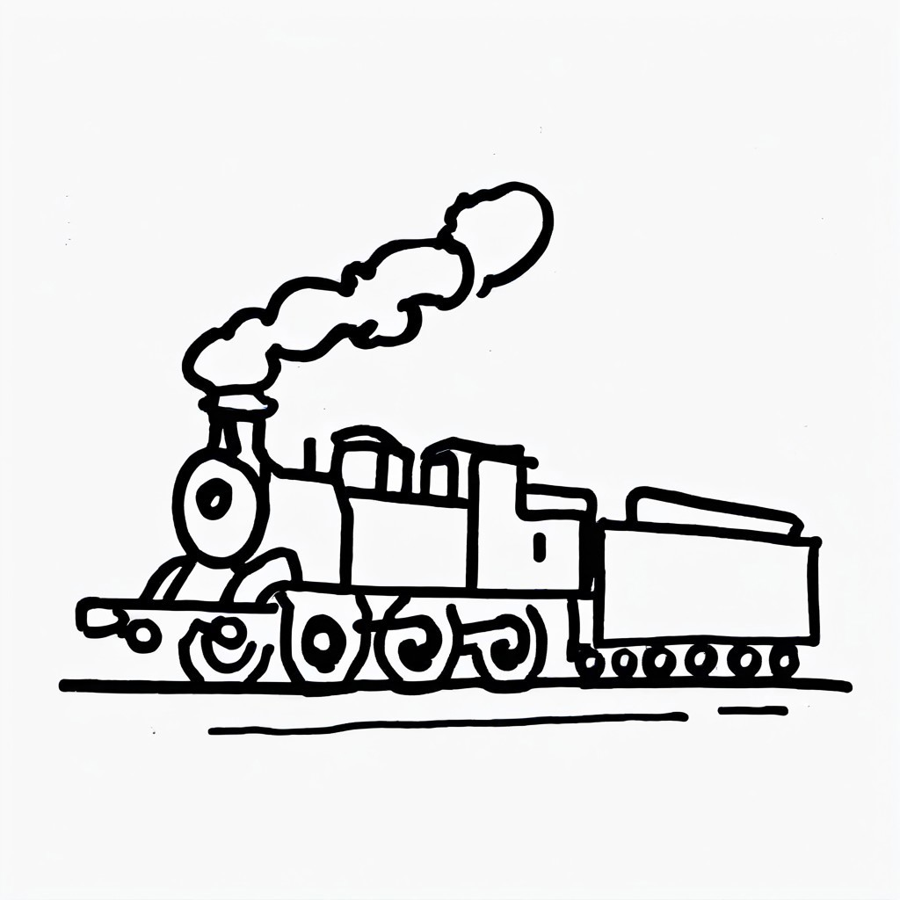

# Unibase Backend



[](https://opensource.org/licenses/MIT)

> Backend API service for Unibase, handling user accounts, projects, and 3D object storage.

## 🏗️ Tech Stack

- Node.js/Express
- SQLite with Kysely
- Docker

## 🚀 Getting Started

### Prerequisites

- Docker & Docker Compose

### Development Setup

1. Start the services:
   ```bash
   docker-compose up
   ```

2. The API will be available at `http://localhost:3000`

## ⚙️ Environment Variables

The `.env` file is automatically configured in Docker. For local development:

```env
DATABASE_URL="sqlite:///$(pwd)/dev.db"
JWT_SECRET="your-secret-key"
```

### Database Migrations

We use dbmate to manage database migrations in the backend directory:

```bash
# Check migration status
dbmate --url sqlite:///$(pwd)/dev.db -d ./src/database/migrations status

# Create a new migration
dbmate --url sqlite:///$(pwd)/dev.db -d ./src/database/migrations new add_your_migration_name

# Apply all pending migrations
dbmate --url sqlite:///$(pwd)/dev.db -d ./src/database/migrations up

# Roll back the most recent migration
dbmate --url sqlite:///$(pwd)/dev.db -d ./src/database/migrations down
```

**Important:** When updating a dbmate migration, 

1. first, read the appropriate schema at `backend/db/schema.sql` before you make schema changes
2. The corresponding model in `src/database/models/` must also be updated to maintain consistency between the database schema and the application code.
3. The corresponding file in `src/database_schema.md` also needs to be updated to have a nice represent

## 📝 License

MIT License - see [LICENSE](LICENSE) for details.